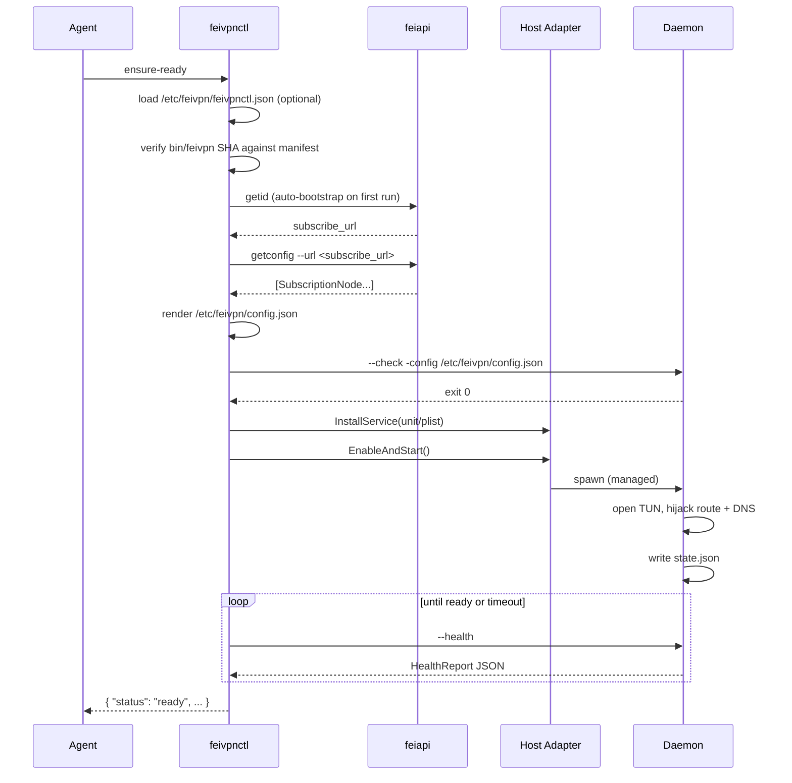

# Architecture

`feivpn-runtime` is intentionally a **thin orchestration layer**. All
the hard parts — TUN devices, routing tables, DNS hijacking, the
forwarding loop — live in the upstream FeiVPN daemon (`feivpn/feivpn-apps`).
This document explains where the line is drawn and why.

## Three layers

### Layer 1 — Skill / CLI (`feivpnctl`)

What it does:
- Loads the user-facing profile (`/etc/feivpn/feivpnctl.json`).
- Drives the upstream `feiapi` CLI to fetch a subscription.
- Renders a daemon `config.json`.
- Asks the host adapter to install and start the service.
- Polls `feivpn --health` until the daemon reports `ready`.
- Prints one machine-readable JSON document on stdout.

What it does NOT do:
- Touch routing tables, TUN devices, `resolv.conf` or `scutil` directly.
  Those are owned by the daemon.
- Talk to the FeiVPN backend API in-process. It spawns the pre-built
  `feiapi` binary so the API secret stays baked into a single auditable
  artefact.
- Perform network downloads at runtime. Binaries are bundled in the
  release tarball; upgrades happen by re-installing the runtime.

### Layer 2 — Daemon (upstream `feivpn`)

The same Go binary that powers the Outline-derived FeiVPN clients
(`feivpn/feivpn-apps/client/go/outline/electron`). On top of its
existing job (TUN forwarding loop) we added three control-plane flags
specifically for this skill:

| Flag         | Purpose                                                       |
| ------------ | ------------------------------------------------------------- |
| `--check`    | Validate a config without touching the network                |
| `--health`   | Print structured JSON describing daemon + tun/route/DNS state |
| `--recover`  | Restore the original default route + DNS from `state.json`    |

Plus a `state.json` file under `/var/lib/feivpn/` written on start and
deleted on graceful shutdown. The Go side mirrors the daemon's structs
in `internal/state/state.go` and `internal/daemon/daemon.go`; that's the
contract — there is no separate schema file to keep in sync.

### Layer 3 — Host adapter (`internal/platform/`)

A tiny per-OS shim:

| OS     | Service manager | Adapter file              |
| ------ | --------------- | ------------------------- |
| Linux  | `systemd`       | `linux_systemd.go`        |
| macOS  | `launchd`       | `darwin_launchd.go`       |

Each adapter implements the same `Adapter` interface
(`InstallService`, `EnableAndStart`, `Stop`, `Disable`, `Uninstall`,
`IsActive`). All branching on `runtime.GOOS` happens *inside* this
package; the rest of the codebase is OS-agnostic.

## End-to-end `ensure-ready` sequence

## Why split the binaries?

We could have built one fat binary, but this layout has two big wins:

1. **Independent upgrade cadence.** A daemon-side bug-fix re-tag does
   NOT force a `feivpnctl` rebuild. Bumping `manifest/binaries.manifest.json`
   plus `make sync-bins` is enough.
2. **Single secret artefact.** The backend API secret is baked into
   `feiapi` via `-ldflags -X` at CI time. `feivpnctl` itself ships
   secret-free, so reading its source teaches you nothing about the API
   credentials.

## Why commit binaries to git?

The binaries live in `bin/` and are tracked in the working tree (see
`bin/README.md`). The downsides (repo size growth) are real, but the
upside is decisive for a *bootstrap* tool: a single `git clone` produces
a working install on a fresh machine, no Releases page round-trips
required. CI fails any push that drifts from the SHA in
`manifest/binaries.manifest.json`.
